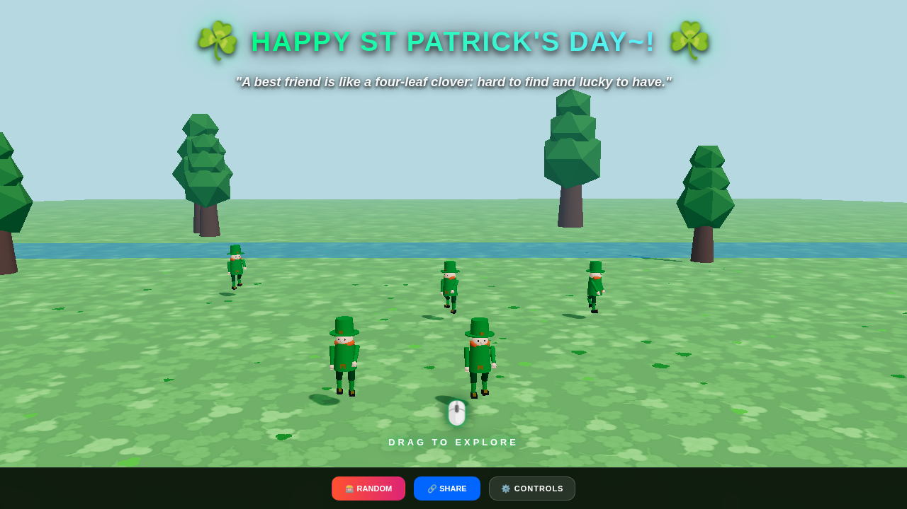
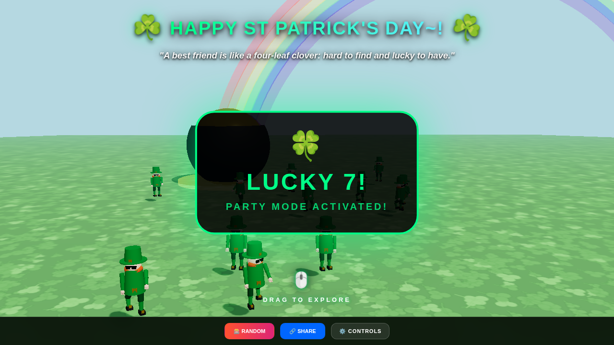
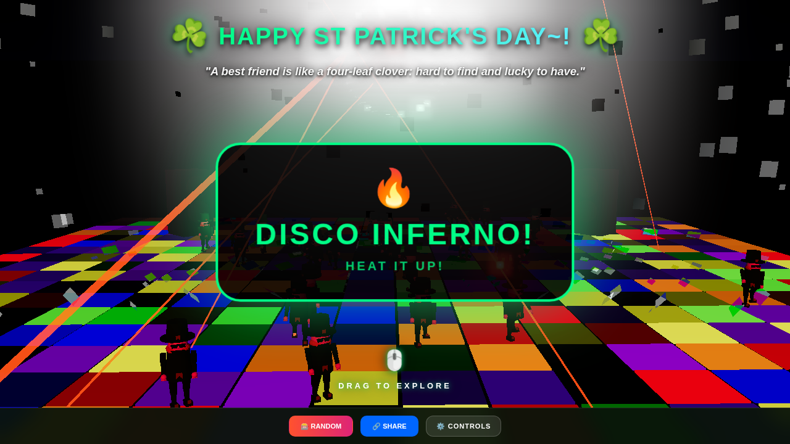

# Leprechaun66

[**Leprechaun66 Live Demo Link **](https://granstaff66.github.io/Leprechaun66)

Welcome to **Leprechaun66**, a festive 3D experience built for St. Patrick's Day! Watch as a horde of up to 66 high-resolution leprechauns dance the night (or day) away in various lucky environments.


[**Live Demo Link**](https://granstaff66.github.io/Leprechaun66)

## Screenshots

<p align="center">
  
  
  
  
</p>

## Features

- **Four Dynamic Environments**: Switch between a peaceful **Meadow**, a lucky **Rainbow**, a high-energy **Disco**, and an atmospheric **Campfire**.
- **High-Resolution Models**: Leprechauns now feature detailed facial features (eyes, nose) and hands with individual fingers.
- **Horde Control**: Scale the party from 1 to 66 dancing leprechauns in real-time.
- **Procedural Textures**: Custom-generated clover fields, fabric textures, and leather materials.
- **Advanced Lighting & Post-Processing**: Includes Unreal Bloom effects, dynamic shadows, a physical disco ball with light projection, and atmospheric scene-specific lighting.
- **Irish Sayings**: Get a dose of luck with various classic Irish sayings and toasts.
- **Easter Eggs & Persistent Rewards**: Discover hidden "Luck" triggers like **Lucky 7**, **Gold Rush**, **Clover Rain**, and **Disco Inferno**. Once discovered, these can be toggled manually from the control panel.
- **Responsive Design**: The canvas automatically scales to fit your browser window for an immersive experience on both desktop and mobile.

## How to Play

- **Atmosphere**: Use the control panel buttons to switch between scenes.
- **Horde Size**: Use the slider in the controls to increase or decrease the number of leprechauns.
- **Randomize**: Click the **🎰 Random** button for a surprise atmosphere and horde count.
- **Interaction**:
  - **Left Click + Drag**: Rotate the camera.
  - **Right Click + Drag**: Pan the camera view.
  - **Scroll**: Zoom in and out.
  - **Auto-Rotation**: The camera will begin to rotate slowly after 5 seconds of inactivity.
- **Unlocked Luck**: Discovering Easter eggs adds a button to your control panel to re-trigger or toggle the effect.

## Hidden Luck (Easter Eggs)

The party has hidden secrets! Here is how to find them:

1.  **Lucky 7**: Click the **🎰 Random** button multiple times. Every 7th click triggers the Lucky 7 party mode!
2.  **Gold Rush**: Increase the leprechaun count to exactly **66**.
3.  **Clover Rain**: Click on the **☘️ shamrock icons** in the top title bar.
4.  **Disco Inferno**: While in the **Disco Time** scene, click the "Disco Time" button **three times consecutively**.

Once discovered, these effects can be toggled manually from the **Unlocked Luck** section in the control panel.

## Tech Stack

- **Three.js**: 3D rendering, animation, and post-processing.
- **Tailwind CSS**: UI styling.
- **JavaScript (ES Modules)**: Modular application architecture.

## How to Run Locally

Since this project uses ES Modules, it requires a local web server to run.

1. **Clone the repository**:
   ```bash
   git clone https://github.com/granstaff66/Leprechaun66.git
   ```
2. **Run a local server**:
   If you have Python installed, you can run:
   ```bash
   python3 -m http.server 8080
   ```
   Then, open your browser and go to `http://localhost:8080`.

## Built with Gemini Canvas & Jules

This project was developed through a collaborative effort between the user and **Jules**, an AI software engineer, utilizing **Gemini Canvas**.

## License

This project is open source and available under the [MIT License](LICENSE).
